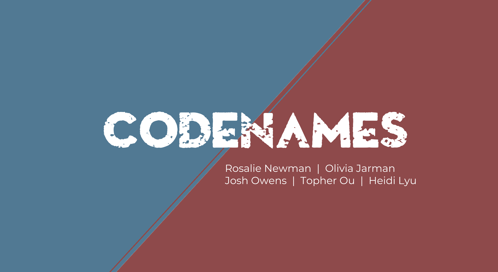

# Codenames



<div class="flex-container"><!-- .element: style="display: flex; flex-direction: row;" -->
  
  
  
  
  
  
  
  
  
</div>

## Play popular card game Codenames with your friends online today!

Fast-paced and easy to learn, simply click the 'create room' button, and invite your friends by sending them the URL in your web browser. Everyone should now enter their usernames, assign themselves teams and roles. The host can now setup the game board- and you're ready to play CODENAMES!

Watch our [presentation and recorded demo video!](https://www.youtube.com/watch?v=nMLCx3XAIkE)

### Getting Started

There are two ways to run our project.

#### Play online

Visit our [website](https://codenames-0nt7.onrender.com) and play!

#### Play locally

1. Clone this repo onto your computer
2. If you don't have it already, install [Postgresql](https://www.postgresql.org/)
3. Open terminal, change directory into the cloned repo's root folder, and and enter each line individually:

```bash
createdb codenames
npm install
npm run seed:dev
npm run start:dev
```

4. Navigate to <http://localhost:3000/> and create a room!
5. For additional players, you will need to have a unique browser visit this port. This can be achieved by creating an incognito tab!

### Diagrams and Images from planning

Our backend models & schema:


A diagram of how players are created and updated, depending on if they created the room or entered it via a link:


### Known Issues

- A player who disconnects mid-game cannot rejoin. They are locked out until the game resets.
- Idling in a room for an indeterminate amount of time may kick you from the room.
- The Timer feature was not completed

### Contributing

Thank you for being interested in contributing to our project. Currently we are not looking for contributions from users outside of our organization.

### Acknowledgements

- Words for the cards sourced from <https://github.com/sagelga/codenames>
- [Adobe Express](https://express.adobe.com/express-apps/logo-maker/) for logo creation
- Fullstack Academy & and our amazing instructor [Ben](https://github.com/Semiroundpizza8) and awesome mentor [Louis](https://github.com/lrabeno)
