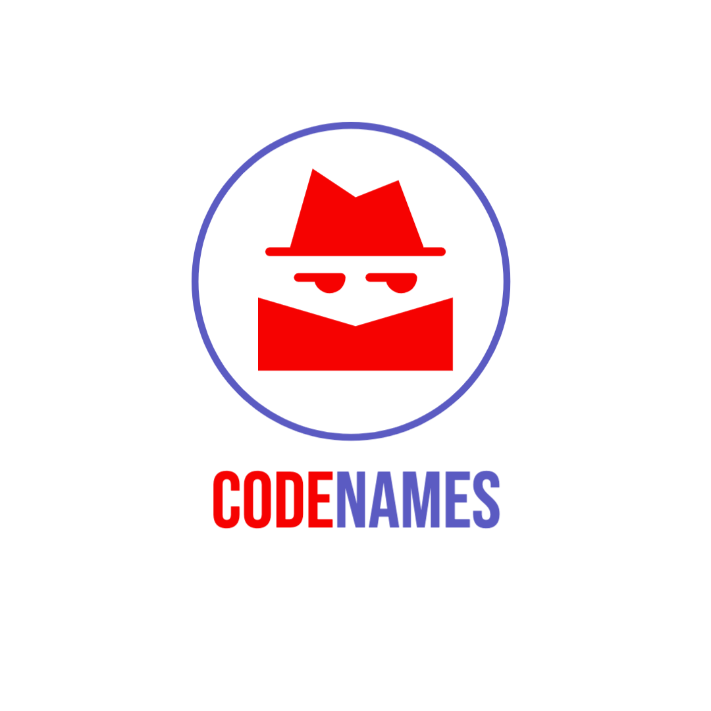
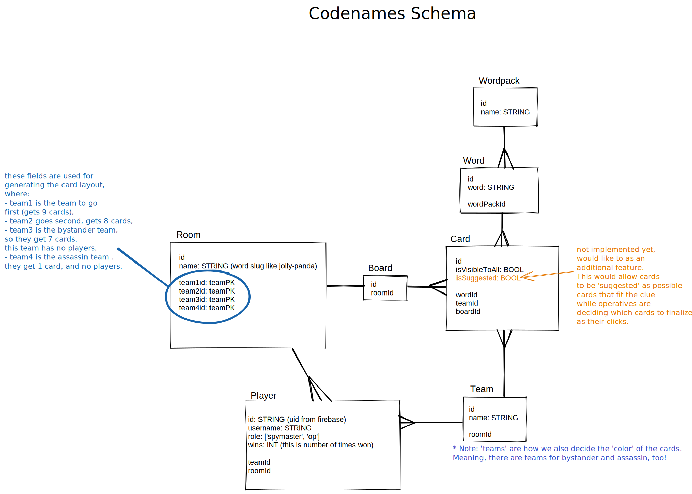
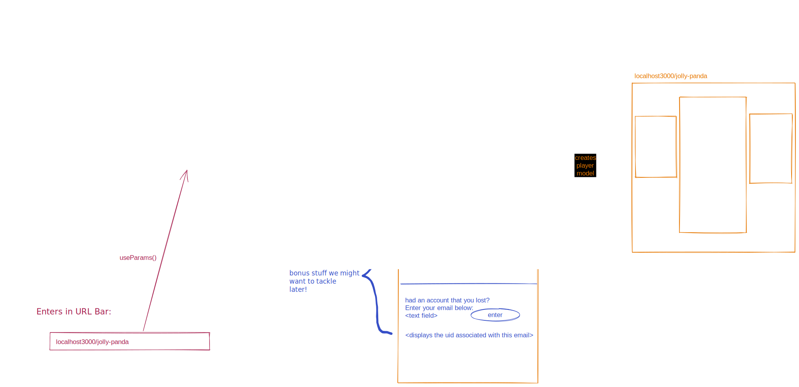

# Codenames



## Play popular card game Codenames with your friends online!

Intro paragraph

### Getting Started

There are two ways to run our project.

#### Play online

Visit our [website](https://codenames-0nt7.onrender.com) and play!

#### Play locally

1. Clone this repo onto your computer
2. If you don't have it already, install [Postgresql](https://www.postgresql.org/)
3. Open terminal, change directory into the cloned repo's root folder, and and enter each line individually:

```bash
createdb codenames
npm install
npm run seed:dev
npm run start:dev
```

4. Navigate to <http://localhost:3000/> and create a room!
5. For additional players, you will need to have a unique browser visit this port. This can be achieved by creating an incognito tab!

### Diagrams and Images from planning

Our backend models & schema:


A diagram of how players are created and updated, depending on if they created the room or entered it via a link:


### Known Issues

- Player must assign themselves a role before the board setup in order to see the board
- Website layout is not mobile friendly

### Contributing

Thank you for being interested in contributing to our project. Currently we are not looking for contributions from users outside of our organization.

### Acknowledgements

- Words for the cards sourced from <https://github.com/sagelga/codenames>
- [Adobe Express](https://express.adobe.com/express-apps/logo-maker/) for logo creation
- Fullstack Academy & and our amazing instructor [Ben](https://github.com/Semiroundpizza8) and awesome mentor [Louis](https://github.com/lrabeno)
